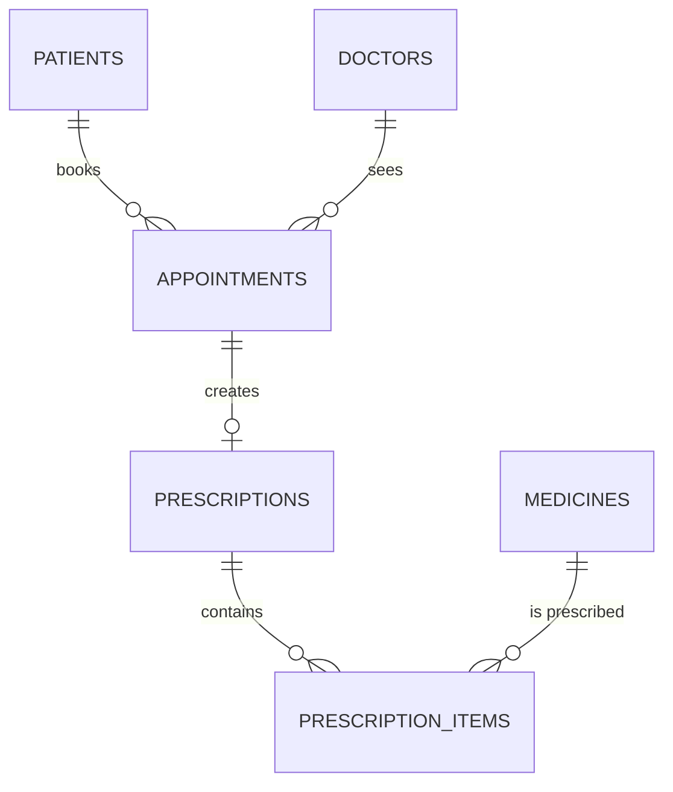

# Hospital Management System (MySQL)

This project is a beginner-friendly **SQL (MySQL) Hospital Management System**. It includes a relational database schema, sample data, and practice queries for common real-world tasks like:

- Booking appointments (with a doctor-availability conflict check)
- Viewing a patient's full appointment history + medicines
- Viewing a doctor's schedule for a specific day
- Analytics such as “most visited doctor” and “most prescribed medicine”

## Files

- `schema.sql` - Creates the database and tables (PKs + FKs)
- `insert.sql` - Inserts sample data
- `queries.sql` - Provides JOIN/GROUP BY/ORDER BY/aggregate queries
- `README.md` - Project explanation (this file)

## How to Run

1. Open MySQL (e.g., MySQL Workbench or the MySQL CLI).
2. Run `schema.sql` (creates database + tables).
3. Run `insert.sql` (adds sample data).
4. Run `queries.sql` (to explore the use cases and analysis queries).

Example using MySQL CLI:

```bash
mysql -u root -p < schema.sql
mysql -u root -p < insert.sql
mysql -u root -p < queries.sql
```

## Database Schema (ER Diagram Explanation)

Core entities and relationships:

- A **Patient** can have many **Appointments**.
- A **Doctor** can have many **Appointments**.
- Each **Appointment** can have at most one **Prescription** (modeled as `prescriptions` with `appointment_id` unique).
- A **Prescription** can contain many **Medicines** (modeled using `prescription_items`).

### Mermaid ER Diagram

You can paste the following into any Mermaid viewer:



### Important Constraints (Beginner Notes)

- `appointments` has a unique constraint `(doctor_id, appointment_datetime)` to reduce the chance of double-booking a doctor at the same time.
- Foreign keys enforce relationships between:
  - `appointments.patient_id -> patients.patient_id`
  - `appointments.doctor_id -> doctors.doctor_id`
  - `prescriptions.appointment_id -> appointments.appointment_id`
  - `prescription_items.prescription_id -> prescriptions.prescription_id`
  - `prescription_items.medicine_id -> medicines.medicine_id`

## Real-World Use Cases Included

`queries.sql` demonstrates examples for:

- **Booking an appointment** (check conflicts before inserting)
- **Doctor schedule** for a date (doctor's appointments + patient names)
- **Patient history** (appointments + joined medicines)
- **Analytics** using aggregates like `COUNT`, `SUM`, `GROUP_CONCAT`, and `DATE_FORMAT`

## Notes

This project is intentionally small but expandable. You can add features like:

- Departments / rooms
- Payment & billing tables
- More detailed diagnosis/treatment tracking

